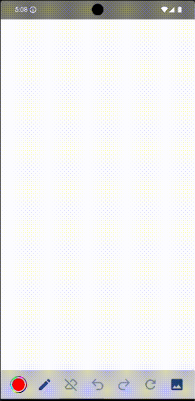
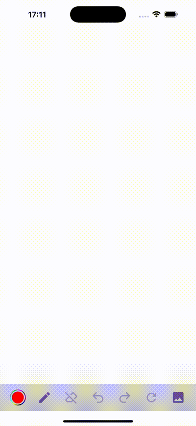

[](https://github.com/Fbada006/ArtMaker/actions/workflows/build.yml)
[](https://androidweekly.net/issues/issue-637)

<h1 align="center" style="font-size: 48px; margin-bottom: 0;">ArtMaker</h1>
<h1 align="center" style="margin-top: 0;">
  
</h1>
<p align="center" style="margin-top: 0;">A Flexible and Lightweight Drawing Library</p>

ArtMaker is a flexible and customisable Android and iOS (through Kotlin Multiplatform - KMP) library that allows users to draw anything they want on
screen and has been built fully with Jetpack Compose. Integrated with advanced features like [Palm Rejection](https://enticio.com/blogs/studio-and-office/a-beginner-s-guide-to-palm-rejection), line style customization, exportation, blazing performance, etc, it allows drawing on screen through the `Canvas`, sharing the drawn `Bitmap`, or programmatically exposing
the `Bitmap` for use in the calling application.

## Demo

| Android                                                         |                             | iOS                                                   |
|-----------------------------------------------------------------|-----------------------------|-------------------------------------------------------|
|  | <div style="padding:30px;"> |  |

## Download

[](https://search.maven.org/artifact/io.github.fbada006/artmaker)

### Setup

Add the following in `settings.gradle.kts` if it has not been included:

```kotlin
repositories {
    mavenCentral()
}
```

In Kotlin Multiplatform (KMP) projects, add the following dependency in your `commonMain` sourceSet:

```kotlin
sourceSets {
    commonMain.dependencies {
        implementation(dependencyNotation = "io.github.fbada006:artmaker:$latest_version")
    }
}
```

In Android projects, add the following dependency in your app-level (or module-level for modularised Android projects) `build.gradle.kts` file:

```kotlin
dependencies {
    implementation(dependencyNotation = "io.github.fbada006:artmaker:$latest_version")
}
```

If you are using Gradle's Version Catalogs, then define the dependency as follows:

```toml
[versions]
artmaker = "$latest-version"

[libraries]
artmaker = { module = "io.github.fbada006:artmaker", version.ref = "artmaker" }
```

Sync your project and then add the dependency as follows:

#### Kotlin Multiplatform

```kotlin
sourceSets {
    commonMain.dependencies {
        implementation(dependencyNotation = libs.artmaker)
    }
}
```

#### Android

```kotlin
dependencies {
    implementation(dependencyNotation = libs.artmaker)
}
```

Find latest version and release notes [here](https://github.com/Fbada006/ArtMaker/releases)

## Usage

**ArtMaker** implements canvas, which allows you to draw points with custom properties.

### Android

You can use `ArtMaker` with default configuration as the following example:

```kotlin
ArtMaker(
    modifier = Modifier.fillMaxSize(),
)
```

In the Android project, you also need to call `ArtMakerInitializer.initialise(this)` inside your activity, otherwise a runtime exception will be
thrown:

```kotlin
class MainActivity : ComponentActivity() {
    override fun onCreate(savedInstanceState: Bundle?) {
        super.onCreate(savedInstanceState)
        ArtMakerInitializer.initialise(this) // Do not forget this line
        setContent {
            ArtMakerTheme {
                ArtMaker(
                    modifier = Modifier.fillMaxSize(),
                )
            }
        }
    }
}
```

You also have full control of `ArtMaker` and choose how you want the control menu composable (the bar below the drawing area) to be
displayed by customizing the `ArtMakerConfiguration` object as shown below:

```kotlin
ArtMaker(
    modifier = Modifier.fillMaxSize(),
    configuration = ArtMakerConfiguration(
        strokeSliderThumbColor = MaterialTheme.colorScheme.primary,
        strokeSliderActiveTrackColor = MaterialTheme.colorScheme.onPrimary,
        strokeSliderInactiveTickColor = MaterialTheme.colorScheme.inversePrimary,
        strokeSliderTextColor = MaterialTheme.colorScheme.secondaryContainer,
        pickerCustomColors = listOf(
            Color.Red, Color.Blue, Color.Green,
        ),
        canvasBackgroundColor = Color.Green.toArgb(),
        controllerBackgroundColor = Color.Cyan,
        strokeSliderBackgroundColor = Color.Magenta,
        canShareArt = true
    )
)
```

If you wish to receive the completed image as a bitmap, you can utilise the `onFinishDrawing: (Bitmap) -> Unit` callback exposed by `ArtMaker` as
follows:

```kotlin
ArtMaker(
    modifier = Modifier.fillMaxSize(),
    onFinishDrawing = { bitmap ->
        // Utilise the bitmap here
    }
)
```

> **_NOTE:_**  The default Jetpack Compose project created by Android Studio for Android has `enableEdgeToEdge()` added in the `onCreate()`. To
> effectively use the library, please ensure that you remove this line.

### iOS

In iOS, you can use the SDK as below:

```swift
import UIKit
import SwiftUI
import artmaker

struct ComposeView: UIViewControllerRepresentable {
    func makeUIViewController(context: Context) -> UIViewController {
        MainViewControllerKt.mainViewController()
    }

    func updateUIViewController(_ uiViewController: UIViewController, context: Context) {}
}

struct ContentView: View {
    var body: some View {
        ComposeView()
    }
}
```

You can then call `ContentView` as follows in your main entry point for iOS as follows:

```swift
import SwiftUI

@main
struct iosAppApp: App {
    var body: some Scene {
        WindowGroup {
            ContentView()
        }
    }
}
```

## Contribute

Do you see any improvements or want to implement a missing feature? Contributions are very welcome!

- Is your contribution relatively small? You can, make your changes, run the code checks, open a PR
  and make sure the CI is green. That's it!
- Are the changes big and do they make a lot of impact? Please open an
  issue [here](https://github.com/Fbada006/ArtMaker/issues?q=is%3Aissue) or reach out
  to [Ferdinand](https://github.com/Fbada006), [Emmanuel](https://github.com/emmanuelmuturia) or [Caleb](https://github.com/CalebKL) and
  let's discuss.
- Ensure your change is properly formatted by running the following command from the terminal:

```gradle
./gradlew spotlessApply
```

The CI will fail if the code is not properly formatted. Please correct any failures before requesting a review.

Take into account that changes and requests can be rejected if they don't align with the **purpose
of the library**. To ensure you do not waste any time, you can always open an
issue [here](https://github.com/Fbada006/ArtMaker/issues/new) or talk to us before you
start making any changes.

## License

     Copyright 2024 ArtMaker, Inc. All Rights Reserved.

     Licensed under the Apache License, Version 2.0 (the "License");
     you may not use this file except in compliance with the License.
     You may obtain a copy of the License at

          http://www.apache.org/licenses/LICENSE-2.0

     Unless required by applicable law or agreed to in writing, software
     distributed under the License is distributed on an "AS IS" BASIS,
     WITHOUT WARRANTIES OR CONDITIONS OF ANY KIND, either express or implied.
     See the License for the specific language governing permissions and
     limitations under the License.
